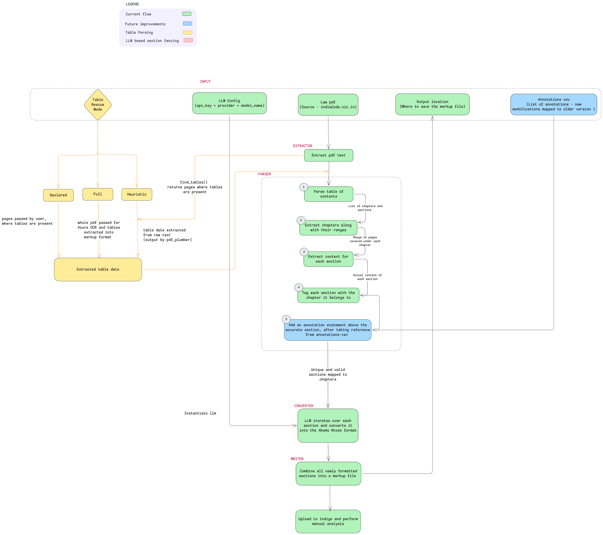

# akoma-markup

akom-markup is an open course tool (pypi package and cli) for converting law pdfs (source - https://www.indiacode.nic.in/) into markup files following the [Akoma Ntoso](https://www.oasis-open.org/standard/akn-v1-0/) / [Laws.Africa](https://laws.africa/) markup format.


# Roadmap


# Setting up for development


## Installation

Install the package in editable mode along with the extra for the LLM provider
you want to use:

```bash
# Anthropic
pip install -e ".[anthropic]"

# Azure AI Inference (Llama, etc.)
pip install -e ".[azure]"
```

## Usage

### As a library

```python
from akoma_markup import convert

# Basic usage
result = convert(
    pdf_path="input_pdf.pdf",
    llm_config={
        "provider": "anthropic",
        "model": "claude-sonnet-4-20250514",
        # api_key picked up from ANTHROPIC_API_KEY if omitted
    },
    output_path="output/bnss_markup.txt",
)
print(result)  # path to the markup file

# With document metadata (recommended for proper identification)
result = convert(
    pdf_path="bnss_2023.pdf",
    llm_config={"provider": "anthropic", "model": "claude-sonnet-4-20250514"},
    output_path="output/bnss_markup.txt",
    document_name="Bharatiya Nagarik Suraksha Sanhita 2023",
    act_number="46 of 2023",
    replaces="Criminal Procedure Code (CrPC) 1973",
)

# For IT Act (no replaces field)
result = convert(
    pdf_path="IT_Act_2021.pdf",
    llm_config={"provider": "anthropic", "model": "claude-sonnet-4-20250514"},
    document_name="Information Technology Act 2000",
    act_number="21 of 2000",
)
```

### As a CLI

```bash
# Inline config
akoma-markup input_pdf.pdf \
  --llm-inline '{"provider": "anthropic", "model": "claude-sonnet-4-20250514"}' \
  -o output/bnss_markup.txt

# From a JSON file
akoma-markup input_pdf.pdf --llm-json llm_config.json

# From a .env file
akoma-markup input_pdf.pdf --llm-env .env
```

## LLM configuration

`llm_config` is a dict with a required `provider` field plus provider-specific
credentials. Common fields: `model`, `temperature` (default `0`), `max_tokens`
(default `4096`).

### Anthropic

```python
{
    "provider": "anthropic",
    "model": "claude-sonnet-4-20250514",
    "api_key": "sk-ant-...",  # or set ANTHROPIC_API_KEY
}
```

### Azure AI Inference

```python
{
    "provider": "azure",
    "endpoint": "https://<your-resource>.cognitiveservices.azure.com/openai/v1/",
    "credential": "<api-key>",  # or set AZURE_INFERENCE_CREDENTIAL
    "model": "Llama-3.3-70B-Instruct",  # must match a deployed model
}
```

Environment variable fallbacks:
`AZURE_INFERENCE_ENDPOINT`, `AZURE_INFERENCE_CREDENTIAL`.

When using `--llm-env`, the CLI reads `PROVIDER`, `AZURE_INFERENCE_ENDPOINT`,
`AZURE_INFERENCE_CREDENTIAL`, `AZURE_MODEL_ID`, `ANTHROPIC_API_KEY`, and
`ANTHROPIC_MODEL_ID` from the file.

## Table rescue (optional)

PDFs that contain tables come out garbled from `pdfplumber` because column
structure is lost when the page is flattened to text. To fix this, `convert`
can optionally re-extract table-bearing pages through Azure Document
Intelligence OCR (which preserves tables as markdown pipe blocks) and splice
the result back into the per-page text stream. The downstream LLM converts
those markdown tables into bluebell `TABLE` blocks during normal section
conversion.

This requires an Azure API key with access to a Document Intelligence
deployment. The endpoint can be passed explicitly or read from the
`AZURE_DOCUMENT_INTELLIGENCE_ENDPOINT` environment variable; the API key
falls back to `AZURE_API_KEY`.

Three modes:

- `declared` — you list the table pages yourself. Cheapest and most
  reliable. Use this when you already know which pages have tables.
- `heuristic` — `pdfplumber.find_tables()` flags pages that contain a
  ruled table. Works well for PDFs with visible cell borders; misses
  whitespace-aligned tables.
- `full` — every page is sent to Azure OCR. Slowest and most expensive,
  but guaranteed to catch every table.

### As a library

```python
from akoma_markup import convert

# Declared mode: you know which pages contain tables
result = convert(
    pdf_path="banking_act.pdf",
    llm_config={"provider": "anthropic", "model": "claude-sonnet-4-20250514"},
    table_mode="declared",
    table_pages=[12, 18, 19, 25],
    azure_api_key="<azure-key>",  # or set AZURE_API_KEY
    azure_ocr_endpoint="https://<resource>.services.ai.azure.com/...",  # optional
)

# Heuristic mode: let pdfplumber flag table pages
result = convert(
    pdf_path="banking_act.pdf",
    llm_config={"provider": "anthropic", "model": "claude-sonnet-4-20250514"},
    table_mode="heuristic",
    azure_api_key="<azure-key>",
)

# Full mode: OCR every page
result = convert(
    pdf_path="banking_act.pdf",
    llm_config={"provider": "anthropic", "model": "claude-sonnet-4-20250514"},
    table_mode="full",
    azure_api_key="<azure-key>",
)
```

### As a CLI

```bash
# Declared mode (--table-pages accepts comma + range syntax)
akoma-markup banking_act.pdf \
  --llm-env .env \
  --table-mode declared \
  --table-pages "12,18-19,25" \
  --azure-api-key "<azure-key>"

# Heuristic mode
akoma-markup banking_act.pdf \
  --llm-env .env \
  --table-mode heuristic

# Full mode (OCR every page)
akoma-markup banking_act.pdf \
  --llm-env .env \
  --table-mode full \
  --azure-ocr-endpoint "https://<resource>.services.ai.azure.com/..."
```

`--azure-api-key` and `--azure-ocr-endpoint` fall back to `AZURE_API_KEY`
and `AZURE_DOCUMENT_INTELLIGENCE_ENDPOINT` (read from `--llm-env` if
provided, or from the process environment).

## Output

Running `convert` produces:

- `<output>.txt` — the Akoma Ntoso plaintext markup
- `<output>.meta.json` — per-section conversion status, errors, chapter info, and document metadata
- `<output>.ocr.txt` — the raw OCR text extracted from the PDF
- `<output-dir>/.akoma_checkpoints/` — intermediate per-section cache that lets
  a failed run resume without re-calling the LLM for already-converted sections

### Metadata file structure

The `.meta.json` file includes:

```json
{
  "conversion_date": "2024-01-15T10:30:00",
  "sections_converted": 531,
  "chapters": 20,
  "errors": 0,
  "ocr_file": "output/bnss_markup.ocr.txt",
  "document": "Bharatiya Nagarik Suraksha Sanhita 2023",
  "act_number": "46 of 2023",
  "replaces": "Criminal Procedure Code (CrPC) 1973"
}
```

Note: `document`, `act_number`, and `replaces` are only included when provided.

## Project layout

```
src/akoma_markup/
  __init__.py     # convert() entry point
  extractor.py    # pdfplumber text extraction
  parser.py       # TOC + section parsing
  converter.py    # LangChain chain + per-section processing
  llm.py          # provider config → chat model
  writer.py       # markup + metadata output
  cli.py          # click-based CLI
```

## Troubleshooting

- **`Error code: 404 - Resource not found` on every section (Azure):** the
  `model` value does not match an active deployment on your endpoint. Check
  your Azure AI Foundry / AI Studio deployments and use the exact deployment
  name.
- **Empty output file with "N sections failed conversion":** every LLM call
  failed. Check credentials, model name, and network access, then rerun — the
  checkpoint cache will skip any sections that did succeed.

## License

Licensed under the [GNU Affero General Public License v3.0 or later](LICENSE)
(AGPL-3.0-or-later). If you run a modified version of this software as a
network service, you must make the modified source code available to its
users.
